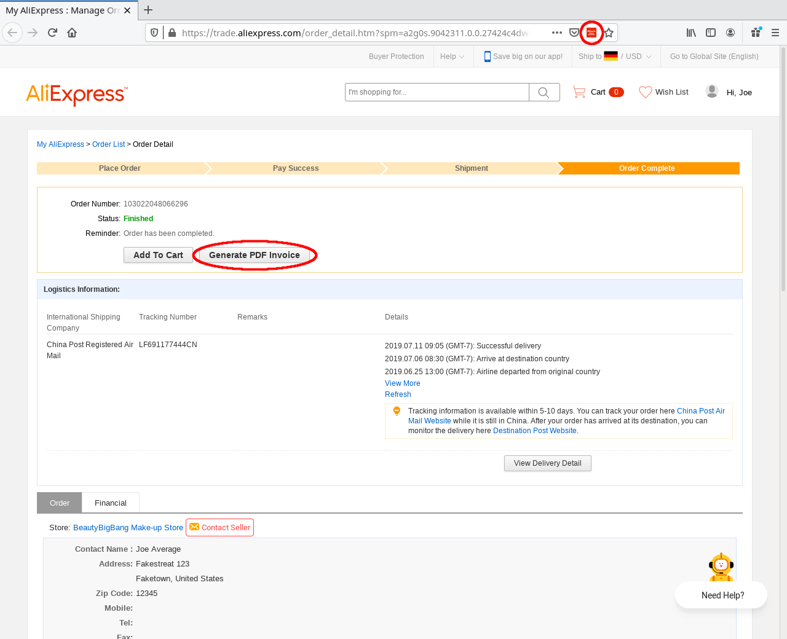
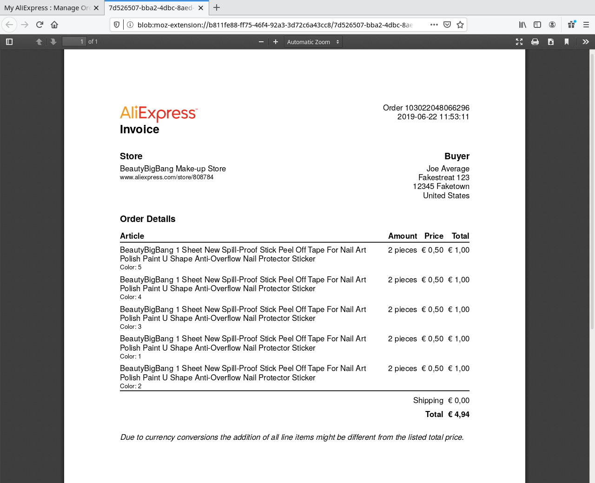
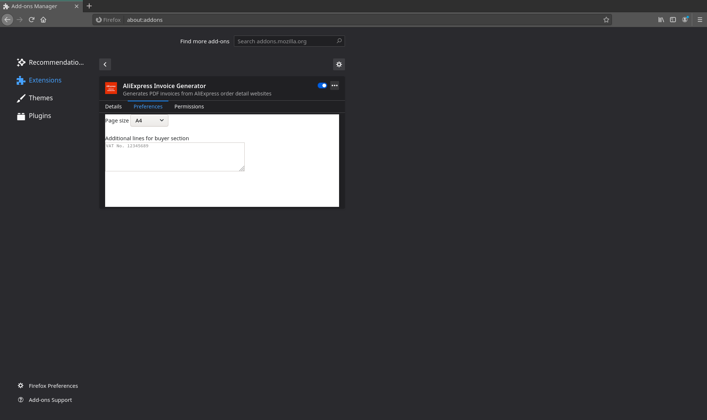

# AliExpress Invoice Generator

This is a Firefox extension for generating PDF invoices from AliExpress order detail
websites. At the time of writing this, AliExpress didn't offer any downloadable
invoice format. For tax reasons, I needed to be able to share the invoices in printed
form and so I ended up creating this extension.

The website content extraction is in part based on [jQuery].

The PDF generation is based on [PDFKit].

## Installing

You can install the extension directly from the official [addons.mozilla.org] website.

## Running (from Code)

For development and testing you can run the extension from code in an isolated browser
instance through `./web-ext run`.

## License

AliExpress Invoice Generator is licensed under the GNU General Public License as published
by the Free Software Foundation, either version 3 of the License, or (at your option) any
later version.

[jQuery] and [PDFKit] are licensed under the MIT license.

[addons.mozilla.org]: https://addons.mozilla.org/en-US/firefox/addon/aliexpress-invoice-generator/
[jQuery]: https://github.com/jquery/jquery
[PDFKit]: https://github.com/foliojs/pdfkit
