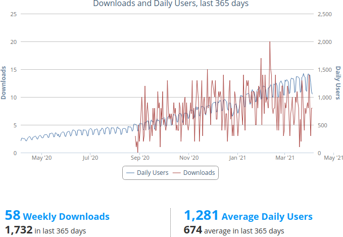

# AliExpress Invoice Generator

This is a browser extension for generating PDF invoices from [AliExpress] order detail
websites. At the time of implementing this, AliExpress didn't offer any downloadable
invoice format. Existing add-ons were closed source and looked rather phishy so I decided
to write my own. I originally developed this add-on for my personal needs only. Many of
the current features were added later, motivated by an ever growing user base and helpful
feedback from like-minded people.

Key features:

- _Free as in beer_ – The add-on doesn't cost you a dime
- _Free as in speech_ – The code is open source so you can modify and use it however you like as long as you adhere to the GPLv3 (or later)
- _Zero tracking_ – The add-on doesn't record any form of analytics. In fact, it doesn't even have permission to send any network requests. Everything you do remains strictly on your computer only.
- _Secure_ – Because the code is open source (which means anyone can inspect and verify it) and no networking is involved, none of your data is at risk of being compromised by the add-on

**1,200 daily users** (on Firefox) and counting!



A few screenshots:


## Installing

You can install the extension directly from the official [addons.mozilla.org] website
or from the [Chrome Web Store].

## Running (from Code)

For development and testing you can run the extension from code in an isolated browser
instance using the following commands:

1. Initialize the plugin (only once):

```
npm install
npm run init
```

2. Build or serve the plugin using the following commands: `npm run serve` or `npm run build`.

## License

AliExpress Invoice Generator is licensed under the GNU General Public License as published
by the Free Software Foundation, either version 3 of the License, or (at your option) any
later version.

[PDFKit] is distributed under the MIT license.

The Droid Sans fonts are distributed under the Apache license.

[AliExpress]: https://www.aliexpress.com
[addons.mozilla.org]: https://addons.mozilla.org/firefox/addon/aliexpress-invoice-generator/
[Chrome Web Store]: https://chrome.google.com/webstore/detail/haebneihcbnfnhbdpokdbkekepnoiadn
[PDFKit]: https://github.com/foliojs/pdfkit
